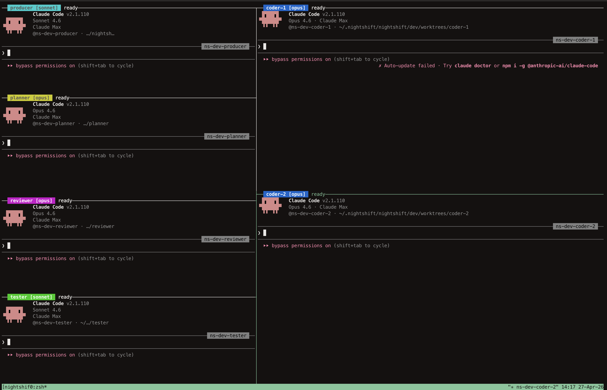

<div align="center">

Set up a "Team of AI agents" in any repository that autonomously triage issues, write plans, review code, implement features, and run tests -- all
orchestrated through GitHub labels - while you sleep. 

Not a Claude Code/Codex replacement - rather a practical workflow to effectively multi-task with coding agents. 

<pre>
███╗   ██╗██╗ ██████╗ ██╗  ██╗████████╗███████╗██╗  ██╗██╗███████╗████████╗
████╗  ██║██║██╔════╝ ██║  ██║╚══██╔══╝██╔════╝██║  ██║██║██╔════╝╚══██╔══╝
██╔██╗ ██║██║██║  ███╗███████║   ██║   ███████╗███████║██║█████╗     ██║   
██║╚██╗██║██║██║   ██║██╔══██║   ██║   ╚════██║██╔══██║██║██╔══╝     ██║   
██║ ╚████║██║╚██████╔╝██║  ██║   ██║   ███████║██║  ██║██║██║        ██║   
╚═╝  ╚═══╝╚═╝ ╚═════╝ ╚═╝  ╚═╝   ╚═╝   ╚══════╝╚═╝  ╚═╝╚═╝╚═╝        ╚═╝   
</pre>

<p>Coordinating AI agents for your development pipeline.</p>
<p>
  <a href="https://github.com/puspesh/nightshift/actions/workflows/ci.yml"></a>
  <a href="LICENSE"></a>
  = 18">
  
  
  <a href="CONTRIBUTING.md"></a>
</p>
</div>

We all wear different hats at different times - sometimes we are a coder, sometimes a tester, sometimes a reviewer, sometimes a project manager (producer) who creates issues, triages and what not. Working with multi-agent workflows requires you to juggle between these hats at rapid intervals which is counter-productive. We as humans are bound by our context-switching limits. Going above to multi-task is not "productive" and leads to AI-slop, drop in quality, lack of control and more. 

**Nightshift** is a different workflow - 
1) You work in day/active time as usual. In your terminal or IDE.
2) While working, you focus on big ticket items. But for all small ideas, bugs, fixes, experiments that you encounter - you create "issues" and do not do active work.
3) Once your day ends, you kickoff your nightshift team (or teams across projects)
4) Let them work and toil while you sleep, live, touch grass!
   
<br>



## Why nightshift?

- **Fully configurable agent profiles** -- define each agent's role, skills, and constraints in markdown. Mimic your own coding style, review standards, and testing preferences
- **End-to-end issue-to-PR pipeline** -- from new issue to merged pull request without human intervention
- **Git worktree isolation** -- each agent works in its own worktree, no branch conflicts
- **GitHub label state machine** -- the entire pipeline state is visible in your issue tracker
- **Headless mode (recommended)** -- run agents as background processes with `--headless`, no manual `/loop` commands needed, logs written to `~/.nightshift/`
- **Scalable coders** -- spin up 1-4 coder agents working in parallel (`--coders 2`)
- **Per-repo customization** -- review criteria, test config, branch patterns, runner command -- all configurable per project in `.claude/nightshift/`

Unlike hosted multi-agent products, nightshift gives you full control over each agent's profile, constraints, and review criteria -- tuned to your repo and your standards. You can take over any agent at any time.

Currently uses/supports - 
1. CLI Agents - Claude Code (supported) / Codex (soon)
2. Issue tracker - Github issues (supported) / local (soon) / linear (future)
3. Agent profiles and Team configuration - yaml and md files (supported)
4. Skills - everything claude code supports (you install in your environment and tune agent profiles accordingly

## What it is NOT

- **Not a Claude Code replacement** -- it orchestrates Claude Code sessions, not replaces them
- **Not a general-purpose agent framework** -- purpose-built for the issue-to-PR development workflow
- **Not a hosted service** -- runs locally on your machine using your Claude Code subscription
- **Not a CI system** -- it creates PRs; your existing CI validates them

## Who is this for?

- Developers who have many parallel tasks and are okay with unattended overnight development work
- Teams experimenting with agentic pull requests and AI-assisted code review
- Solo developers who want to wake up to triaged issues and draft PRs


## Quick Start

### Pre-requisities
1. Claude Code
2. tmux
3. gh

### Install

**curl (recommended)**
```bash
curl -fsSL https://raw.githubusercontent.com/puspesh/nightshift/main/install.sh | bash
```

**npm / pnpm / bun**
```bash
npm install -g @nightshift-team/nightshift
# or
pnpm add -g @nightshift-team/nightshift
# or
bun add -g @nightshift-team/nightshift
```

**From source**
```bash
git clone https://github.com/puspesh/nightshift.git
cd nightshift
npm install && npm run build
npm link
```

### Set up a team

```bash
# In your repository
nightshift init --team dev
```

This sets up everything: agent profiles, pipeline extensions, git worktrees,
and GitHub labels for the `dev` team. Then customize and start the agents:

```bash
# Edit your config files
vi .claude/nightshift/repo.md                    # commands, branch patterns (shared)
vi .claude/nightshift/ns-dev-review-criteria.md  # code review checklist
vi .claude/nightshift/ns-dev-test-config.md      # test configuration

# Start all agents in a tmux session
nightshift start --team dev
```

This opens a tmux session with a split-pane layout:

```
┌──────────┬─────────────────┐
│ producer │                 │
├──────────┤    coder-1      │
│ planner  │                 │
├──────────┼─────────────────┤
│ reviewer │    coder-2      │
├──────────┤                 │
│ tester   │                 │
└──────────┴─────────────────┘
```

Each pane has a color-coded label showing its role, the `/loop` command to type,
and a live status indicator (working/idle with countdown timer). Navigate panes
with `Ctrl+b, arrow`. Detach with `Ctrl+b, d` (agents keep running).

If [agentville](https://github.com/puspesh/agentville) is installed, a
visualization server launches at `http://localhost:4321` showing a pixel-art office
world with agents as animated citizens, plus a real-time status panel.

### Headless Mode (Recommended)

Use `--headless` to run agents as background processes -- no tmux, no manual
`/loop` commands. Each agent starts working immediately:

```bash
nightshift start --team dev --headless
```

Agents loop every 15 minutes. Logs are written to
`~/.nightshift/<repo>/<team>/logs/<role>.log`.

```bash
# Check agent logs
tail -f ~/.nightshift/<repo>/<team>/logs/producer.log

# Stop all agents
nightshift stop --team dev
```

> **Why headless?** In tmux mode you need to type the `/loop` command in each
> pane to start an agent. Headless mode handles this automatically -- just start
> and walk away.

### Multiple Coders

Use the `--coders` flag to add multiple coder agents:

```bash
nightshift init --team dev --coders 2
nightshift start --team dev --headless   # both coders start automatically
```

## How It Works

### Teams

nightshift organizes agents into **teams**. Each team is an independent pipeline
with its own set of agents, worktrees, and label namespace. You can run multiple
teams in parallel (e.g., `dev`, `infra` etc) without interference.

### State Machine

Issues flow through the pipeline via GitHub labels:

```
[new issue]
     |
     v
@producer: triage
     |
     v
dev:planning -----> @planner: write plan
     |
     v
dev:plan-review --> @reviewer: review plan
     |                      |
     v                      v
dev:approved        dev:plan-revising (back to planner)
     |
     v
@coder: implement
     |
     v
dev:code-review --> @reviewer: review code
     |                      |
     v                      v
dev:testing         dev:code-revising (back to coder)
     |
     v
@tester: run tests
     |
     v
dev:ready-to-merge --> human merges
```

### Agent Roles

| Agent | Role |
|-------|------|
| **@ns-dev-producer** | Triages new issues, creates branches, monitors health |
| **@ns-dev-planner** | Explores codebase, writes implementation plans |
| **@ns-dev-reviewer** | Reviews plans and code for quality |
| **@ns-dev-coder** | Implements from approved plans, raises PRs |
| **@ns-dev-tester** | Runs tests against PRs, reports results |

### Three-Layer Architecture

1. **Pipeline machinery** (agent profiles in `~/.claude/agents/`) -- the generic
   workflow, state machine, and guard rails. Managed by nightshift.

2. **Pipeline extensions** (`.claude/nightshift/*.md` in your repo) -- project-specific
   commands, review criteria, test configuration. Customized by you.

3. **Project context** (`CLAUDE.md`) -- your project's structure, conventions,
   and documentation. Already in your repo.

## Set up with Claude Code

Already have Claude Code? Paste this repo and get started:

> I just cloned nightshift. Help me run `nightshift init --team dev` in my
> project repo, configure it for my stack, and start the agents.

Claude Code can help you customize the pipeline extensions, write your `repo.md`,
and troubleshoot any setup issues.

## Commands

```bash
# Initialize a team
nightshift init --team dev

# Launch all agents in a tmux session
nightshift start --team dev

# Headless mode (recommended — no manual /loop needed)
nightshift start --team dev --headless

# Stop all agents
nightshift stop --team dev

# List all installed teams and their agents
nightshift list

# Teardown a team (interactive confirmation)
nightshift teardown --team dev

# Skip confirmation
nightshift teardown --team dev --force

# Also remove GitHub labels
nightshift teardown --team dev --force --remove-labels
```

### Runner Configuration

The `start` command reads the runner command from `.claude/nightshift/repo.md`.
Default:

```
claude --dangerously-skip-permissions
```

Customize it to change flags, model, or permissions for all agents.

## Prerequisites

- [Claude Code](https://docs.anthropic.com/claude-code) -- the AI coding assistant
- [GitHub CLI (gh)](https://cli.github.com/) -- for label and issue management
- [git](https://git-scm.com/) -- for worktree isolation
- [tmux](https://github.com/tmux/tmux) -- for the default `start` command; not needed with `--headless` (`brew install tmux`)

## Documentation

- [Quickstart](docs/quickstart.md) -- full walkthrough from zero to first merged PR
- [FAQ](docs/faq.md) -- answers to common questions
- [Compatibility](docs/compatibility.md) -- supported versions and platforms
- [Customization Guide](docs/customization.md) -- how to configure for your stack
- [Architecture](docs/architecture.md) -- deep dive on the state machine and concurrency
- [Adding Agents](docs/adding-agents.md) -- how to extend the pipeline
- [Troubleshooting](docs/troubleshooting.md) -- common issues and fixes

## Examples

See the `examples/` directory for ready-to-use extension sets:

- **TypeScript monorepo** (pnpm, Turborepo, Vitest, Playwright)
- **Python FastAPI** (uv, pytest, mypy, SQLAlchemy)
- **Go service** (go test, golangci-lint, testcontainers)

Copy any example's files into your `.claude/nightshift/` directory as a starting point.

## Roadmap

- [ ] Codex support
- [ ] Additional team presets beyond `dev`, `content`
- [ ] Codex integration for adversarial code review inside Claude workflows
- [ ] Agentville(!)

## Contributing

Contributions are welcome! Please read the [Contributing Guide](CONTRIBUTING.md) and our [Code of Conduct](CODE_OF_CONDUCT.md) before submitting pull requests.

## License

MIT
